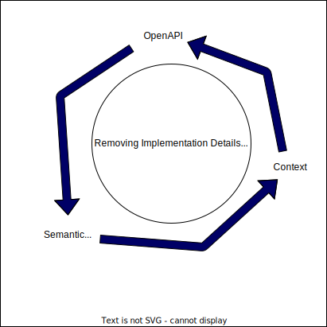
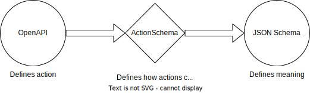

This repo showcases some of the datastructures I've been working on that are used throughout my work.

For now, it's nothing official yet, and the intention is to first create something very useful, then think about making it an open standard.

These JSON Schemas serve as the source of truth for the specification of them, which is why they contain clear descriptions, which is useful in Typescript and other places.

# Semantic OpenAPI

OpenAPI, AsyncAPI and others are doing a great job at specifying how API endoints are to be requested, and how to interpret the response. They also define security practices in the APIs. However, these implementation details of how HTTP Requests work aren't important to what a function does semantically.

This datastructure aims to create the simplest possible way to describe the functionality of any API. Both auth and the HTTP implementations are separate concerns that can be handled elsewhere based on the API Specification.

With this datastructure and the tooling around it, I am targeting all API-based frameworks and standards that want to do things with semantics of functionality rather than the implementation details such as auth and http.

Examples are my previous version of ActionSchema and the Arazzo specification, but there are probably lots more tools that could benefit for this simplified datastructure.

# ActionSchema

ActionSchema intends to be a new standard allowing developers to create data-centric codebases. ActionSchema is a superset of [JSON-Schema](https://json-schema.org) connecting meaning to how this meaning is obtained through [OpenAPIs](https://www.openapis.org/) and code execution.

## Motivation

- It's hard and complex to build long chains on top of unreliable functions such as LLM's and other transformer AI, if you can't see what is happening in each part of the chain.
- It's hard to work with OpenAPIs while the potential is giant.
- Increased locality of behavior: keep your code where you describe your data and keep a SSOT. (See [LoB Principle](https://htmx.org/essays/locality-of-behaviour/))

# Flat Object

This is at the core of the simplification. A flat object is a subset of JSON-Schema that doesn't allow for recursion in the JSON object, effectively allowing for easier manipulation of everything defined with these constraints.
